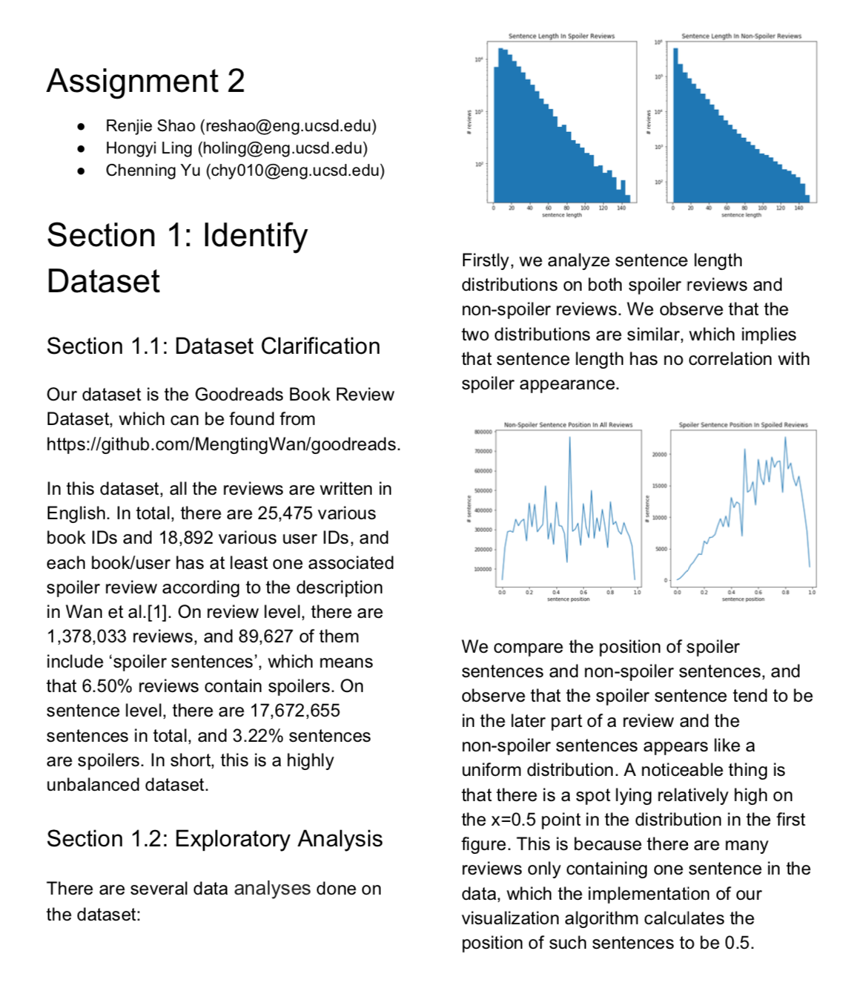

# Spoiler Classification for GoodRead Reviews

This is the repo for Assignment 2 of [Web Mining and Recommendation System](https://cseweb.ucsd.edu/classes/fa19/cse258-a/). In this assignment, our team focus on how to detect spoiler given a book review.

We use the Logistic Regression with several tests on various feature selections, and profoundly analyze our results on the measure of the meaning of the learnt coefficients, and the effectiveness of ensemble approach.

More details are covered in [this paper](./final.pdf).

A brief preview:

